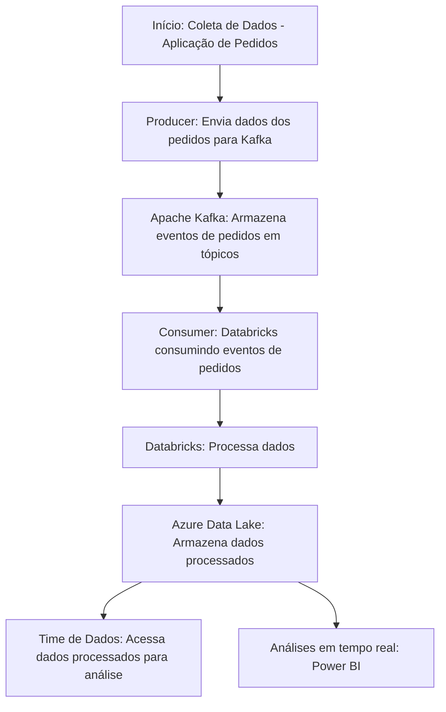

# Case Técnico Engenheiro de Dados -> Processamento de pedidos em Real Time

>"O objetivo desse case é criar um desenho de solução, com passo a passo para orientar um engenheiro de dados desenvolver uma solução de dados real time para a squad de pedidos. O resultado desse desenho deverá orientar as pessoas de dados e da squad com a solução. Esses documentos servirão como insumo para iniciar o desenvolvimento.
>A squad de produtos hoje conta com um(a) PM e pessoas de engenharia de software. Esse time fará parte da solução, criando o transacional da nossa solução de dados, portanto é necessário desenharmos a solução que contemple eles. Aqui é necessário sugerir uma arquitetura e ferramentas para a Squad, contextualizando tecnicamente e funcionalmente o time. A stack do lado de dados conta com um Databricks na Azure, mas ainda não tem uma solução para dados real time.
Os dados que receberemos estão nesse modelo ([https://www.kaggle.com/datasets/gabrielramos87/an-online-shop-business](https://www.kaggle.com/datasets/gabrielramos87/an-online-shop-business))
>É necessário também desenvolver um trecho de código para servir de exemplo para os engenheiros de software e de dados. Aqui, deixamos a sua escolha qual parte do código deseja construir para servir de exemplo. Podemos utilizar, Python, Pyspark, Sql e/ou Scala. Precisamos também explicar os motivadores para a escolha de tecnologia.
>Para documentar essa solução utilize uma ferramenta como [Draw.io](http://draw.io/), Miro ou excalidraw e para o código, utilize o github."

## Tecnologias Escolhidas

- **Spark**: É uma ferramenta para processar grandes volumes de dados de forma rápida, pois trabalha com dados em memória. Suporta várias linguagens e é ideal para análise de dados, machine learning e processamento em tempo real.

- **Python**: Uma linguagem de programação popular por ser simples e poderosa. Muito usada em ciência de dados, automação e machine learning, com várias bibliotecas que facilitam o trabalho com dados.

- **Azure Databricks Notebook**: Uma interface interativa no Databricks (integrado com Azure) onde você pode rodar códigos (Python, SQL, etc.) em um ambiente colaborativo, ótimo para análise e ciência de dados.

- **Airflow**: Plataforma para automatizar e gerenciar tarefas. Ele organiza fluxos de trabalho como um "passo a passo", ideal para programar e monitorar pipelines de dados.

- **Docker**: Ferramenta que cria containers onde aplicativos rodam de forma isolada e consistente, independente do ambiente. Facilita desenvolvimento, testes e implantação de software.

- **Confluent e Kafka**: Kafka é uma ferramenta para lidar com grandes quantidades de dados em tempo real, como logs e eventos. Confluent é uma versão gerenciada do Kafka, com recursos extras para facilitar seu uso em empresas.

- **Delta Live Tables**: Garante a qualidade dos dados automaticamente ao permitir que você defina regras de validação e acompanhe os dados em tempo real. Ele limpa, monitora e ajusta os dados durante o processamento, evitando problemas antes de chegarem às análises. 

## Arquitetura

Um **Data Lakehouse** é uma arquitetura que une o melhor dos dois mundos: a flexibilidade de um **data lake** (onde você pode armazenar grandes volumes de dados brutos) e a estrutura organizada de um **data warehouse** (que facilita consultas rápidas e bem estruturadas) em uma estrutura chamada de "*Medalhão*", que virou uma marca chave do **DataBricks**.
A escolha dessa arquitetura, a depender da escalabilidade do projeto, traz o benefício de poder virar um **Data Mesh** no futuro, o Lakehouse é uma ótima opção para crescer porque oferece uma plataforma central, mas com a liberdade para que cada equipe cuide dos seus próprios dados de forma independente. Isso permite que os times trabalhem de forma autônoma, mantendo a governança e garantindo que os dados sejam acessíveis e de qualidade para todos.

## Processamento de pedidos

O **Apache Kafka**, facilita a ingestão de dados de pedidos em tempo real, a escolha do **Confluent** para esse projeto é a facilidade de uso, gerenciamento e escalabilidade de aplicações de streaming de dados em tempo real. Ela foi criada pelos fundadores do Kafka e conta com um grande arsenal e recursos que podem tornar todo o processamento de dados em algo mais robusto. Ele irá funcionar assim:

- **Produtores** ou **Producers** enviam os dados de cada pedido para um **tópico** no Kafka. Esses dados podem incluir detalhes do pedido, como produtos comprados, valores, e informações do cliente.
    
- O Kafka atua como um **broker**, armazenando os pedidos dentro dos tópicos de forma distribuída, garantindo alta disponibilidade e resiliência. Ele permite a ingestão de grandes volumes de dados continuamente e com baixa latência.
    
- **Consumidores** ou **Consumers** (como sistemas de análise, bancos de dados, ou pipelines de dados) se inscrevem nos tópicos do Kafka e podem ler os dados em tempo real para processar ou armazenar os pedidos, garantindo que as informações fluam imediatamente para onde são necessárias.

## Database
### Camada Bronze (Raw Data)

Essa camada é armazenada no [Blob Storage](https://azure.microsoft.com/pt-br/products/storage/blobs/) e recebe os dados brutos diretamente das fontes, como logs de transações de vendas, interações de usuários no site e inventário de produtos. Os dados chegam de forma não processada, sem transformação, preservando o histórico completo e podendo conter inconsistências ou duplicidades. Seu objetivo é servir como um backup fiel da origem dos dados.

### Camada Silver (Cleaned Data)

Utilizando o [Delta Lake](https://learn.microsoft.com/en-us/azure/databricks/delta/) e [Delta Live Tables](https://docs.databricks.com/pt/delta-live-tables/index.html), a camada **Silver** aplica transformações iniciais nos dados da camada Bronze. Aqui, os dados são limpos, filtrados e padronizados para remover duplicatas e inconsistências. Essa camada traz os dados em um formato mais organizado e pronto para análise de operações diárias, como análises de comportamento de compra, tendências de vendas, e criação de relatórios operacionais. Ela mantém a granularidade dos dados, permitindo consultas mais rápidas.

### Camada Gold (Aggregated Data)

Na camada **Gold**, também baseada no [Delta Lake](https://learn.microsoft.com/en-us/azure/databricks/delta/) e [Delta Live Tables](https://docs.databricks.com/pt/delta-live-tables/index.html), os dados são otimizados e agregados para análise avançada e geração de insights estratégicos. Informações como relatórios financeiros, métricas de performance de vendas, análises de marketing e personalização de ofertas são derivadas desta camada. Ela oferece dados sumarizados e preparados para consumo por times de negócio ou modelos de machine learning, focando em performance e tomada de decisão.

## Orquestrador

A ferramenta escolhida para o orquestramento é o **Apache Airflow**, que gerencia workflows por meio de DAGs (Grafos Acíclicos Dirigidos) escritas em Python. Essas DAGs são facilmente escaláveis à medida que o volume de dados, tarefas e workflows cresce. Além disso, o Airflow oferece vantagens mesmo em soluções em tempo real, pois facilita o gerenciamento de dependências, permite configurar políticas de **retry** e agendamentos complexos, e integra-se facilmente com outras ferramentas, como **Databricks** e **Kafka**.

## Consumo de dados

Para o consumo dos dados desse projeto, ferramentas como o **Power BI**, que já possuem integração nativa com o **Azure**, são uma ótima escolha para análise e visualização em tempo real. O Power BI pode se conectar diretamente ao **Azure Data Lake**, **Azure Synapse Analytics**, ou **Delta Lake**, e permitir que você consuma os dados processados pela pipeline em tempo real ou com atualizações agendadas.

- **Roadmap da solução**

## Requisitos

Antes de começar, você precisará instalar e configurar os seguintes componentes:

- **Confluent CLI** para gerenciar o cluster Confluent Cloud
- **Python 3.12.**
- Uma conta no **Confluent Cloud** ou um ambiente local do Confluent

