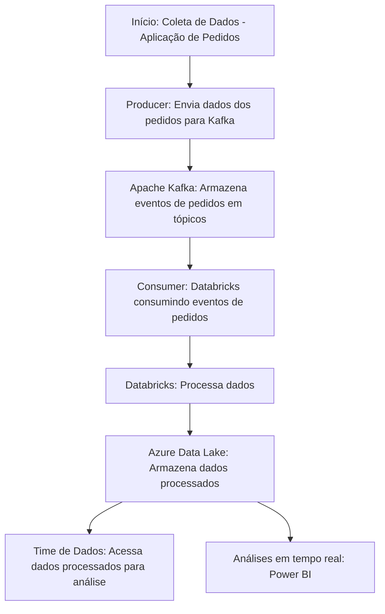

# Case Técnico Engenheiro de Dados -> Processamento de pedidos em Real Time

Este projeto foi desenvolvido para a empresa **JUNTOS SOMOS MAIS** e visa implementar um fluxo de dados em tempo real utilizando o **Confluent**, **Apache Kafka** e **Python**. 
O projeto realiza a leitura de dados de uma tabela chamada **E-commerce Business Transaction** e processa esses dados em real-time.

## Contexto

- **Objetivo**
  - Criar um **desenho de solução** com um passo a passo para orientar um engenheiro de dados no desenvolvimento de uma solução de dados em tempo real para a squad de pedidos.
  - O resultado do desenho deverá orientar tanto as pessoas de dados quanto a squad de pedidos.

- **Documentação:**
  - Os documentos gerados servirão como **insumo** para iniciar o desenvolvimento da solução.

- **Equipe envolvida:**
  - A squad de produtos
  - A equipe de engenharia de software

- **Arquitetura e ferramentas:**
  - Sugerir uma **arquitetura** e ferramentas para a squad de pedidos.
  - O desenho da solução precisa **contextualizar tecnicamente e funcionalmente** o time.
  - A stack de dados utiliza o **Databricks** na Azure, mas ainda não há uma solução para dados em tempo real.

- **Dados a serem utilizados:**
  - O modelo de dados que será utilizado está disponível em: [Kaggle Dataset - Online Shop Business](https://www.kaggle.com/datasets/gabrielramos87/an-online-shop-business).

- **Exemplo de código:**
  - Desenvolver um **trecho de código** de exemplo para os engenheiros de software e de dados.
  - Pode-se utilizar **Python, PySpark, SQL** ou **Scala**.
  - A escolha da tecnologia deve ser justificada com base em **motivadores técnicos**.

- **Ferramentas para documentação:**
  - Para documentar a solução, utilizar ferramentas como **Draw.io**, **Miro** ou **Excalidraw**.
  - O código deve ser disponibilizado no **GitHub**.

- **Prazos e entrega:**
  - O prazo para realizar o case é de **5 dias**, com entrega até **16 de outubro**.
  - O resultado deverá ser enviado respondendo ao e-mail original.

- **Encerramento:**
  - A mensagem é finalizada com um agradecimento pelo contato anterior.

## Requisitos

Antes de começar, você precisará instalar e configurar os seguintes componentes:

- **Confluent CLI** para gerenciar o cluster Confluent Cloud
- **Python 3.x**
- Bibliotecas Python necessárias (veja abaixo como instalar)
- Uma conta no **Confluent Cloud** ou um ambiente local do Confluent

## Tecnologias Escolhidas

**Apache Kafka (Confluent)** 
Escolhemos o Kafka por sua escalabilidade, alta taxa de throughput e confiabilidade 
para lidar com eventos em tempo real. A solução gerenciada pela Confluent simplifica
o gerenciamento e monitoração do Kafka, permitindo à equipe focar no desenvolvimento 
da solução. Além de contar com inúmeras ferramentas que podem auxiliar na movimentação
dos dados e governança. É uma solução paga.

**Python**
Usamos Python tanto para o producer quanto para o consumer pela simplicidade
da linguagem e pela vasta integração com bibliotecas de dados, como Kafka, PySpark e 
serviços da Azure. É Open Source

**Azure Databricks**
O Databricks é uma plataforma unificada de análise de dados que permite processamento
de grandes volumes de dados em tempo real. A escolha do Databricks simplifica o 
processamento de dados em escala, além de oferecer suporte nativo para PySpark, 
o que facilita a transformação e a análise.

**Azure Data Lake**
Utilizamos o Data Lake como armazenamento final por sua alta escalabilidade
e capacidade de integração com outras ferramentas da Azure, como Databricks, Synapse Analytics e Power BI.
Orientamos manter a escolha dos serviços Azure uma vez que o desafio propões
o uso de Azure Databricks.

## Conclusão

Este projeto demonstra como configurar um pipeline de dados em real-time utilizando **Confluent**, **Apache Kafka** e **Python**, focando na transmissão de dados da tabela **E-commerce Business Transaction**. A flexibilidade do Kafka permite que você escale e processe eventos de maneira eficiente em diversas situações de negócios.

---

Se precisar de mais detalhes ou ajustes específicos, me avise!
