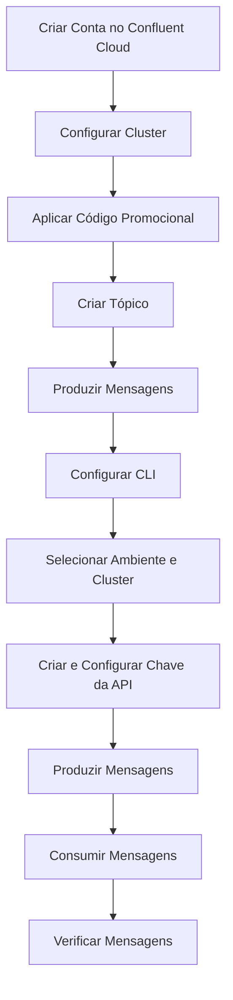

# Configurando o Confluent CLI

## Pré-requisitos

1. **Confluent Cloud Cluster:** Tenha o cluster e o CLI do Confluent Cloud configurados como indicado nos exercícios anteriores.
2. **Kafka CLI:** Certifique-se de ter o Kafka CLI instalado e conectado ao cluster no Confluent Cloud.

## Etapas do Exercício

### 1. Criar Conta no Confluent Cloud

- Acesse o site [Confluent Cloud](https://confluent.cloud/).
- Preencha os campos com nome, email e senha.
- Clique em "Start Free" e confirme seu email para finalizar o cadastro.

### 2. Configurar o Cluster

- Após confirmar o email, siga os passos de configuração.
- Escolha o **cluster básico** para o exercício.

### 3. Aplicar Código Promocional

- No painel, vá até "Settings" > "Billing and Payment".
- Insira o código `kafka101` para receber $101 de créditos.

### 4. Criar um Tópico

#### Via Interface Web

- Acesse a aba "Topics" e clique em "Create Topic".
- Nomeie o tópico como `tecnologias` e mantenha as 6 partições padrão.

#### Via CLI

- No terminal, crie o tópico com o comando:

    ```bash
    confluent kafka topic create tecnologias --partitions 6
    ```

### 5. Produzir Mensagens Usando a Interface Web

- Na aba "Messages", clique em "Produce a new message to this topic".
- Insira `1` como chave e `Python` como valor, e clique em "Produce".

### 6. Configurar o CLI

- Baixe e configure o CLI a partir da seção "CLI and Tools" no Confluent Cloud.
- No terminal, faça login com:

    ```bash
    confluent login --save
    ```

- Utilize o mesmo email e senha cadastrados anteriormente.

### 7. Escolher Ambiente e Cluster

- Liste os ambientes disponíveis com:

    ```bash
    confluent environment list
    ```

- Selecione o ambiente desejado:

    ```bash
    confluent environment use <environment_id>
    ```

- Liste e escolha o cluster Kafka:

    ```bash
    confluent kafka cluster list
    confluent kafka cluster use <cluster_id>
    ```

### 8. Gerar e Configurar Chave da API

- Crie uma chave de API:

    ```bash
    confluent api-key create --resource <cluster_id>
    ```

- Guarde a chave e o segredo gerados.
- Configure a chave para uso:

    ```bash
    confluent api-key use <api_key> --resource <cluster_id>
    ```

### 9. Produzir Mensagens Usando o CLI

- Liste os tópicos disponíveis:

    ```bash
    confluent kafka topic list
    ```

- Produza mensagens para o tópico `tecnologias` com o comando:

    ```bash
    confluent kafka topic produce time-pedido
    ```

- Insira as mensagens uma a uma no formato `chave:valor`:

    ```
    1:Python
    2:SQL
    3:Kafka
    4:Spark
    5:Airflow
    6:Kubernetes
    7:Terraform
    8:Docker
    ```

### 10. Consumir Mensagens Usando o CLI

- Abra um novo terminal e consuma as mensagens do início do tópico:

    ```bash
    confluent kafka topic consume tecnologias --from-beginning
    ```

### 11. Verificar Mensagens no Console Web

- Retorne à interface web do Confluent Cloud e confira as mensagens enviadas.
- Para visualização detalhada, ajuste o offset para zero e analise as partições.


---

### Diagrama de Fluxo



